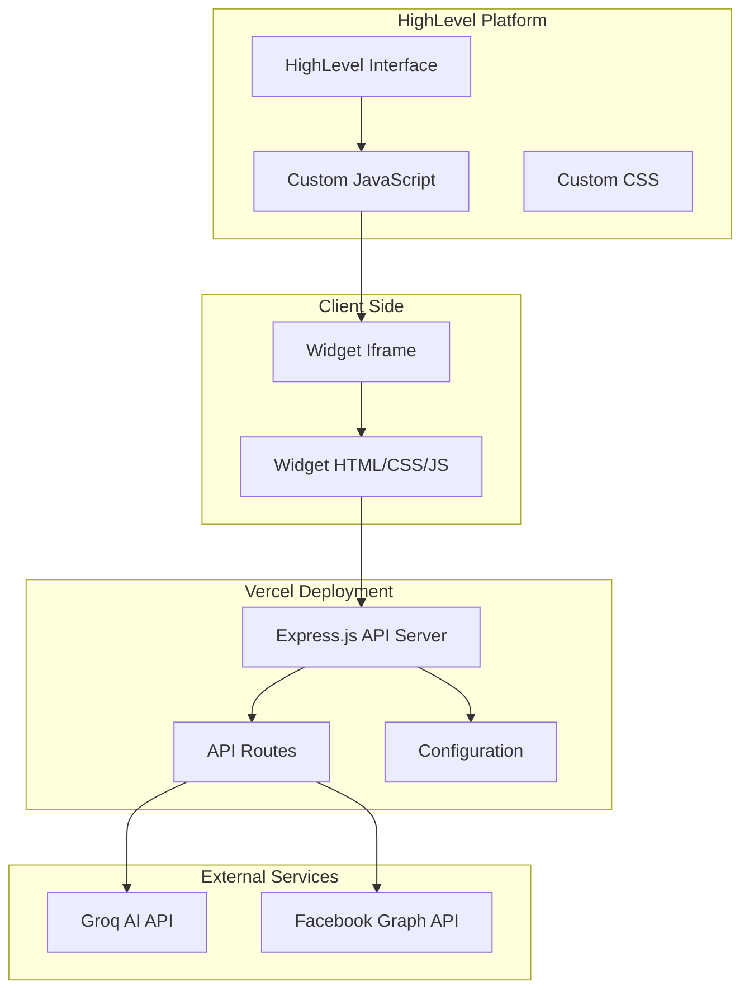
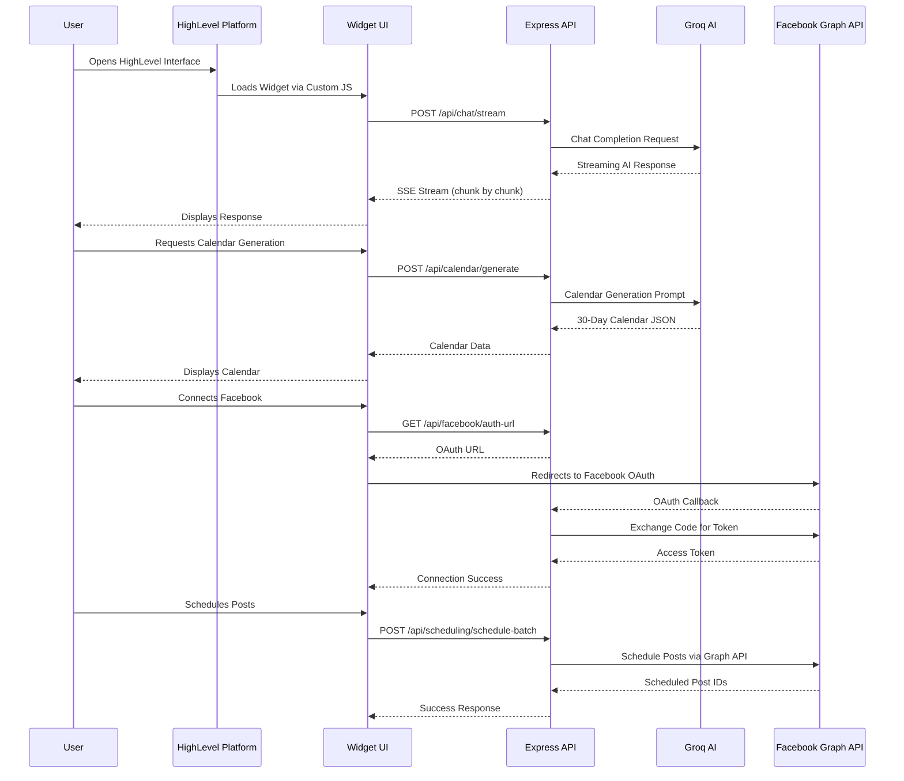
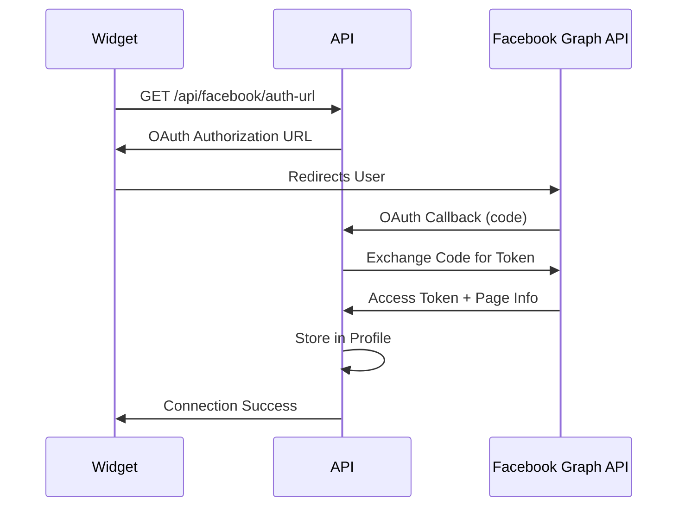

# HighLevel Copilot - AI Assistant for Content Calendar & Social Media Management

## Overview

HighLevel Copilot is an AI-powered widget that integrates seamlessly into HighLevel's platform, enabling users to generate content calendars, schedule social media posts, and manage their Facebook presence through natural language conversations.

## Architecture

### System Architecture Diagram



### Data Flow Diagram



## Technology Stack

### 1. Custom JavaScript (HighLevel Integration)

**Purpose**: Embeds the widget into HighLevel's platform without requiring app store approval.

**Implementation**:
- Self-contained JavaScript injected via HighLevel's Custom JS feature
- Creates floating toggle button with sidebar widget
- Manages iframe communication and postMessage API
- Handles widget lifecycle (open/close animations)

**Key Features**:
- Sidebar layout with backdrop overlay
- Cache-busting for widget updates
- Cross-origin communication via postMessage
- Responsive design for mobile/desktop

**Location**: `integration/highlevel-integration.js`

**Trade-offs**:
- ✅ **Pros**: No app store approval needed, full control over UI/UX, instant deployment
- ❌ **Cons**: Limited to Custom JS capabilities, no native HighLevel API access, requires manual updates

### 2. Node.js (Express Backend)

**Purpose**: Server-side API handling, business logic, and integration with external services.

**Architecture**:
```
backend/
├── server.js          # Express app setup, middleware, routing
├── routes/
│   ├── chat.js        # AI chat endpoints (streaming & non-streaming)
│   ├── calendar.js    # Content calendar generation
│   ├── facebook.js    # Facebook OAuth & connection management
│   ├── scheduling.js   # Post scheduling (single & batch)
│   └── profile.js     # Business profile management
├── utils/
│   └── profileStorage.js  # In-memory profile storage
├── constants.js       # Centralized constants (errors, URLs, etc.)
└── vercel-entry.js    # Vercel serverless entry point
```

**Key Features**:
- RESTful API design
- Server-Sent Events (SSE) for streaming AI responses
- Session management for conversation history
- Error handling with centralized constants
- CORS configuration for HighLevel domain

**Trade-offs**:
- ✅ **Pros**: Fast development, rich ecosystem, easy deployment to Vercel
- ❌ **Cons**: In-memory storage (not persistent), single server instance limitations

### 3. Groq AI (LLM Integration)

**Purpose**: Powers natural language conversations and content generation.

**Model**: `llama-3.3-70b-versatile`

**Use Cases**:
1. **Conversational AI**: Natural business discovery through chat
2. **Content Calendar Generation**: Creates 30-day social media calendars
3. **Dynamic Quick Replies**: Context-aware response options

**Implementation**:
```javascript
// Streaming chat response
const stream = await groq.chat.completions.create({
  model: 'llama-3.3-70b-versatile',
  messages: conversationHistory,
  temperature: 0.7,
  max_tokens: 1000,
  stream: true
});
```

**Prompt Engineering**:
- System prompts define conversation flow
- Context reminders guide AI behavior
- Dynamic quick reply generation
- Industry-agnostic (no hardcoded industries)

**Trade-offs**:
- ✅ **Pros**: Fast inference, cost-effective, good for streaming
- ❌ **Cons**: Less creative than GPT-4, requires careful prompt engineering

### 4. Facebook Graph API

**Purpose**: OAuth authentication and post scheduling on Facebook Pages.

**OAuth Flow**:


**Endpoints Used**:
- `/oauth/authorize` - OAuth authorization
- `/oauth/access_token` - Token exchange
- `/me/accounts` - Get user's pages
- `/{page-id}/feed` - Schedule posts

**Permissions**:
- `pages_manage_posts` - Schedule and publish posts
- `pages_read_engagement` - Read page insights
- `pages_show_list` - List user's pages

**Trade-offs**:
- ✅ **Pros**: Official API, reliable, feature-rich
- ❌ **Cons**: Complex OAuth flow, rate limits, requires app review for production

### 5. Vercel (Deployment Platform)

**Purpose**: Serverless deployment with automatic scaling and edge distribution.

**Configuration** (`vercel.json`):
```json
{
  "builds": [{ "src": "backend/server.js", "use": "@vercel/node" }],
  "routes": [
    { "src": "/api/(.*)", "dest": "backend/server.js" },
    { "src": "/widget/(.*)", "dest": "backend/server.js" }
  ]
}
```

**Features**:
- Serverless functions (automatic scaling)
- Edge network (low latency globally)
- Environment variable management
- Automatic HTTPS
- Zero-downtime deployments

**Trade-offs**:
- ✅ **Pros**: Easy deployment, automatic scaling, global CDN, free tier
- ❌ **Cons**: Cold starts, 10-second timeout limit, vendor lock-in

## Technical Architecture Trade-offs

### 1. In-Memory Storage vs Database

**Current**: In-memory Maps for conversations and profiles

**Trade-offs**:
- ✅ **Pros**: Zero setup, fast, works for demos
- ❌ **Cons**: Data lost on restart, no persistence, single instance only

**Future**: Migrate to Redis or PostgreSQL for production

### 2. Streaming vs Non-Streaming Responses

**Current**: Both endpoints available (`/stream` and `/`)

**Trade-offs**:
- ✅ **Streaming**: Better UX, perceived performance, real-time feedback
- ❌ **Streaming**: More complex error handling, connection management

### 3. Widget Embedding: Iframe vs Custom Element

**Current**: Iframe embedding via Custom JS

**Trade-offs**:
- ✅ **Iframe**: Isolation, security, easy updates
- ❌ **Iframe**: Cross-origin complexity, limited parent communication

### 4. AI Provider: Groq vs OpenAI

**Current**: Groq (Llama models)

**Trade-offs**:
- ✅ **Groq**: Faster, cheaper, good for structured tasks
- ❌ **Groq**: Less creative, requires better prompts
- ✅ **OpenAI**: More creative, better at complex reasoning
- ❌ **OpenAI**: Slower, more expensive

### 5. Deployment: Vercel vs Traditional Server

**Current**: Vercel serverless

**Trade-offs**:
- ✅ **Vercel**: Auto-scaling, global CDN, zero ops
- ❌ **Vercel**: Cold starts, timeout limits, vendor lock-in
- ✅ **Traditional**: Full control, no cold starts, longer timeouts
- ❌ **Traditional**: Manual scaling, server management, higher costs

## Project Structure

```
highlevel-copilot/
├── backend/              # Node.js/Express API
│   ├── routes/          # API route handlers
│   ├── utils/           # Utility functions
│   ├── constants.js     # Application constants
│   ├── server.js        # Express server
│   └── vercel-entry.js  # Vercel entry point
├── frontend/            # Widget UI
│   ├── widget.html      # Widget markup
│   ├── widget.css       # Widget styles
│   └── widget.js        # Widget logic
├── integration/         # HighLevel integration files
│   ├── highlevel-integration.js
│   └── highlevel-integration.css
├── config/              # Configuration
│   └── config.js        # Centralized config
├── tests/               # Playwright tests
├── scripts/             # Utility scripts
├── assets/              # Static assets
├── docs/                # Documentation
├── package.json
├── vercel.json
└── README.md
```

## Key Features

1. **Natural Language Chat**: AI-powered conversation to discover business needs
2. **Content Calendar Generation**: 30-day social media calendars with themes, captions, and hashtags
3. **Facebook Integration**: OAuth connection and post scheduling
4. **Batch Scheduling**: Schedule multiple posts at once
5. **Streaming Responses**: Real-time AI response streaming for better UX
6. **Dynamic Quick Replies**: Context-aware response options

## Environment Variables

Required environment variables (set in Vercel dashboard or `.env` file):

   ```bash
# AI Configuration
GROQ_API_KEY=your_groq_api_key
GROQ_MODEL=llama-3.3-70b-versatile

# Facebook Configuration
FACEBOOK_APP_ID=your_facebook_app_id
FACEBOOK_APP_SECRET=your_facebook_app_secret

# Server Configuration
PORT=3000
NODE_ENV=production
SESSION_SECRET=your_session_secret
```

## Getting Started

1. **Deploy to Vercel**:
   ```bash
   npm install -g vercel
   vercel login
   vercel --prod
   ```

2. **Configure HighLevel**:
   - Copy `integration/highlevel-integration.js` to HighLevel Custom JS
   - Copy `integration/highlevel-integration.css` to HighLevel Custom CSS
   - Update `COPILOT_API_URL` with your Vercel URL

3. **Set Environment Variables**:
   - Add all required variables in Vercel dashboard

4. **Test**:
   - Open HighLevel interface
   - Click the floating "Ask AI" button
   - Start a conversation

## API Endpoints

- `POST /api/chat/stream` - Streaming chat endpoint
- `POST /api/chat` - Non-streaming chat endpoint
- `POST /api/calendar/generate` - Generate content calendar
- `GET /api/facebook/auth-url` - Get Facebook OAuth URL
- `GET /api/facebook/callback` - Facebook OAuth callback
- `POST /api/scheduling/schedule` - Schedule single post
- `POST /api/scheduling/schedule-batch` - Schedule multiple posts

## License

ISC

