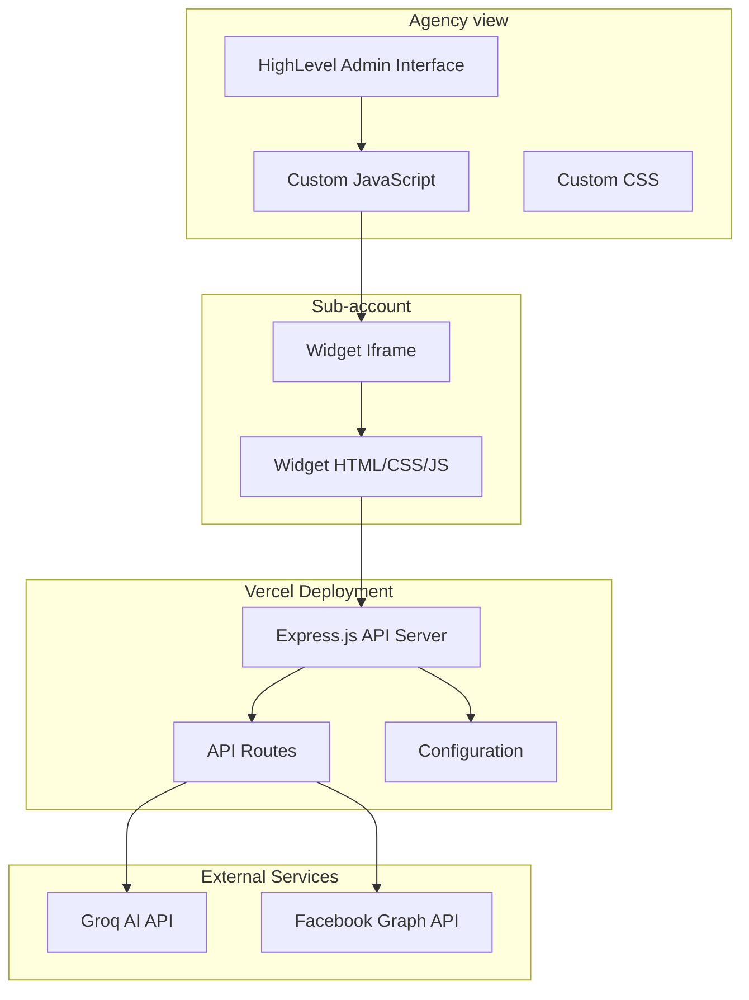
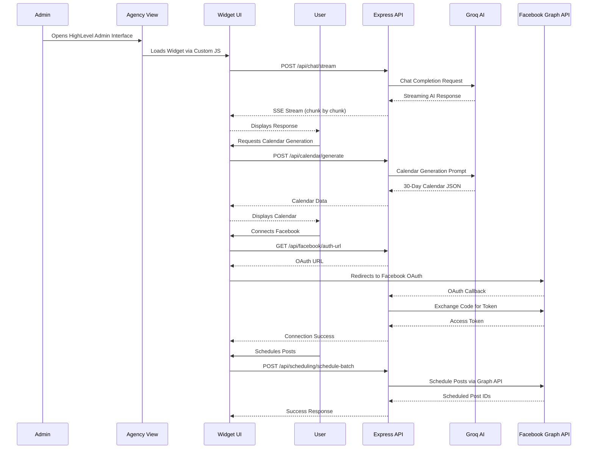
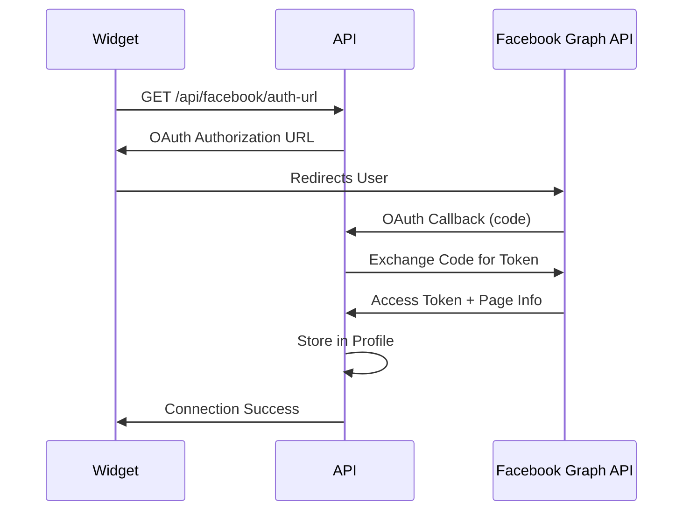

# HighLevel Copilot - AI Assistant for Content Calendar & Social Media Management

## Overview

HighLevel Copilot is an AI-powered widget that integrates seamlessly into HighLevel's platform, enabling users to generate content calendars, schedule social media posts, and manage their Facebook presence through natural language conversations.

## Architecture

### System Architecture Diagram



### Data Flow Diagram



## Technology Stack

### 1. Custom JavaScript (HighLevel Integration)

**Purpose**: Embeds the widget into HighLevel's platform without requiring app store approval.

**Implementation**:
- Self-contained JavaScript injected via HighLevel's Custom JS feature
- Creates floating toggle button with sidebar widget
- Manages iframe communication and postMessage API
- Handles widget lifecycle (open/close animations)

**Key Features**:
- Sidebar layout with backdrop overlay
- Cache-busting for widget updates
- Cross-origin communication via postMessage
- Responsive design for mobile/desktop

**Location**: `integration/highlevel-integration.js`

### 2. Node.js (Express Backend)

**Purpose**: Server-side API handling, business logic, and integration with external services.

**Architecture**:
```
backend/
├── server.js          # Express app setup, middleware, routing
├── routes/
│   ├── chat.js        # AI chat endpoints (streaming & non-streaming)
│   ├── calendar.js    # Content calendar generation
│   ├── facebook.js    # Facebook OAuth & connection management
│   ├── scheduling.js   # Post scheduling (single & batch)
│   └── profile.js     # Business profile management
├── utils/
│   └── profileStorage.js  # In-memory profile storage
├── constants.js       # Centralized constants (errors, URLs, etc.)
└── vercel-entry.js    # Vercel serverless entry point
```

**Key Features**:
- RESTful API design
- Server-Sent Events (SSE) for streaming AI responses
- Session management for conversation history
- Error handling with centralized constants
- CORS configuration for HighLevel domain

### 3. Groq AI (LLM Integration)

**Purpose**: Powers natural language conversations and content generation.

**Model**: `llama-3.3-70b-versatile`

**Use Cases**:
1. **Conversational AI**: Natural business discovery through chat
2. **Content Calendar Generation**: Creates 30-day social media calendars
3. **Dynamic Quick Replies**: Context-aware response options

**Implementation**:
```javascript
// Streaming chat response
const stream = await groq.chat.completions.create({
  model: 'llama-3.3-70b-versatile',
  messages: conversationHistory,
  temperature: 0.7,
  max_tokens: 1000,
  stream: true
});
```

**Prompt Engineering**:
- System prompts define conversation flow
- Context reminders guide AI behavior
- Dynamic quick reply generation
- Industry-agnostic (no hardcoded industries)
- LLM-powered information extraction (replaces keyword-based parsing)

### 4. Facebook Graph API

**Purpose**: OAuth authentication and post scheduling on Facebook Pages.

**OAuth Flow**:


**Endpoints Used**:
- `/oauth/authorize` - OAuth authorization
- `/oauth/access_token` - Token exchange
- `/me/accounts` - Get user's pages
- `/{page-id}/feed` - Schedule posts

**Permissions**:
- `pages_manage_posts` - Schedule and publish posts
- `pages_read_engagement` - Read page insights
- `pages_show_list` - List user's pages

### 5. LangGraph State Machine (Conversation Flow Management)

**Purpose**: Manages conversation state transitions and context-aware AI prompts using LangGraph.js StateGraph for robust state management.

**Implementation**:
```javascript
// LangGraph StateGraph manages conversation flow
const { StateGraph, Annotation } = require('@langchain/langgraph');

// Define state schema with Annotation.Root
const StateSchema = Annotation.Root({
    currentState: Annotation({ reducer: (x, y) => y ?? x }),
    businessProfile: Annotation({ reducer: (x, y) => y ?? x }),
    // ... other state fields
});

// Build and compile the graph
const workflow = new StateGraph(StateSchema);
workflow.addNode('determine_state', determineStateNode);
workflow.setEntryPoint('determine_state');
workflow.addEdge('determine_state', END);
const graph = workflow.compile();

// Use in conversation flow
const state = initializeState(businessProfile, conversationHistory, facebookConnected);
const contextReminder = getContextReminderForState(state);
const nextState = await determineNextState(state); // Uses LangGraph
```

**Conversation States**:
- `GREETING` - Initial welcome and industry discovery
- `COLLECTING_INDUSTRY` - Gathering business industry
- `COLLECTING_PRODUCTS_SERVICES` - Understanding offerings
- `COLLECTING_AUDIENCE` - Identifying target customers
- `COLLECTING_TONE` - Determining brand voice
- `FACEBOOK_CONNECTION_REQUIRED` - Prompting for Facebook OAuth
- `FACEBOOK_CONNECTED` - Facebook linked, ready for content
- `POST_GENERATION_READY` - All information gathered, can generate posts

**Key Features**:
- **LangGraph.js StateGraph**: Uses `@langchain/langgraph` for robust, graph-based state management
- **Data-driven state transitions**: No hardcoded message patterns (e.g., "hi", "hello", "start")
- **LLM-powered extraction**: Business profile information extracted via Groq API, not keyword matching
- **Context-aware prompts**: AI receives state-specific context reminders to guide conversation
- **Zero hardcoding**: Conversation flow determined by profile completeness and conversation history length
- **State persistence**: State maintained across widget close/open cycles via session storage

**State Schema**:
```javascript
{
  currentState: String,
  businessProfile: Object,
  conversationHistory: Array,
  userResponseCount: Number,
  facebookConnected: Boolean,
  lastQuestionAsked: String,
  metadata: Object
}
```

**Location**: `backend/utils/conversationState.js`

### 6. Vercel (Deployment Platform)

**Purpose**: Serverless deployment with automatic scaling and edge distribution.

**Configuration** (`vercel.json`):
```json
{
  "builds": [{ "src": "backend/server.js", "use": "@vercel/node" }],
  "routes": [
    { "src": "/api/(.*)", "dest": "backend/server.js" },
    { "src": "/widget/(.*)", "dest": "backend/server.js" }
  ]
}
```

**Features**:
- Serverless functions (automatic scaling)
- Edge network (low latency globally)
- Environment variable management
- Automatic HTTPS
- Zero-downtime deployments

## Technical Architecture Trade-offs

1. **MCP Integration vs Direct API Integration**
   - **Chosen**: Direct Facebook Graph API integration
   - **Reason**: Sandbox limitations and lack of official Facebook MCP server
   - **Impact**: Code is less scalable for additional social media channels. Each new platform requires custom routes/endpoints rather than a unified MCP-based plugin architecture
   - **Future**: MCP integration would enable a plugin-style architecture where each social platform is a separate MCP server

2. **In-Memory Storage vs Persistent Database**
   - **Chosen**: In-memory `Map()` storage for conversations, profiles, and OAuth states
   - **Impact**: Data lost on server restart, no multi-instance support, OAuth states can expire
   - **Future**: Migrate to Redis or PostgreSQL for production persistence

3. **CSS Units: px vs rem**
   - **Chosen**: Pixel-based (`px`) units throughout the widget CSS
   - **Impact**: Design doesn't respect user font size preferences, reduced accessibility
   - **Future**: Migrate to `rem` units for better accessibility and user preference support

4. **CORS Configuration: Open to All Origins**
   - **Chosen**: `origin: '*'` allows any domain to access the API
   - **Impact**: Security risk in production; should be restricted to HighLevel domain
   - **Future**: Restrict CORS to specific HighLevel domains in production environment

5. **No Explicit Authentication/Authorization**
   - **Chosen**: Relies on HighLevel's session context; `userId` passed from widget but not validated server-side
   - **Impact**: No protection against unauthorized access or user impersonation
   - **Future**: Add JWT validation or HighLevel API token verification

6. **Synchronous Post Scheduling (No Queue System)**
   - **Chosen**: Post scheduling happens synchronously during API request
   - **Impact**: Long-running requests, no retry mechanism, failures block user
   - **Future**: Background job queue (Bull, BullMQ) for async scheduling with retries

7. **No Rate Limiting**
   - **Chosen**: API endpoints have no rate limiting
   - **Impact**: Vulnerable to abuse, DDoS, or excessive API costs
   - **Future**: Add rate limiting middleware (e.g., `express-rate-limit`)

## Project Structure

```
highlevel-copilot/
├── backend/              # Node.js/Express API
│   ├── routes/          # API route handlers
│   ├── utils/           # Utility functions
│   │   └── conversationState.js  # LangGraph-inspired state machine
│   ├── constants.js     # Application constants
│   ├── server.js        # Express server
│   └── vercel-entry.js  # Vercel entry point
├── frontend/            # Widget UI
│   ├── widget.html      # Widget markup
│   ├── widget.css       # Widget styles
│   └── widget.js        # Widget logic
├── integration/         # HighLevel integration files
│   ├── highlevel-integration.js
│   └── highlevel-integration.css
├── config/              # Configuration
│   └── config.js        # Centralized config
├── tests/               # Playwright tests
├── scripts/             # Utility scripts
├── assets/              # Static assets
├── docs/                # Documentation
├── package.json
├── vercel.json
└── README.md
```

## Key Features

1. **Natural Language Chat**: AI-powered conversation to discover business needs
2. **Content Calendar Generation**: 30-day social media calendars with themes, captions, and hashtags
3. **Facebook Integration**: OAuth connection and post scheduling
4. **Batch Scheduling**: Schedule multiple posts at once
5. **Streaming Responses**: Real-time AI response streaming for better UX
6. **Dynamic Quick Replies**: Context-aware response options

## Environment Variables

Required environment variables (set in Vercel dashboard or `.env` file):

   ```bash
# AI Configuration
GROQ_API_KEY=your_groq_api_key
GROQ_MODEL=llama-3.3-70b-versatile

# Facebook Configuration
FACEBOOK_APP_ID=your_facebook_app_id
FACEBOOK_APP_SECRET=your_facebook_app_secret

# Server Configuration
PORT=3000
NODE_ENV=production
SESSION_SECRET=your_session_secret
```

## Getting Started

1. **Deploy to Vercel**:
   ```bash
   npm install -g vercel
   vercel login
   vercel --prod
   ```

2. **Configure HighLevel**:
   - Copy `integration/highlevel-integration.js` to HighLevel Custom JS
   - Copy `integration/highlevel-integration.css` to HighLevel Custom CSS
   - Update `COPILOT_API_URL` with your Vercel URL

3. **Set Environment Variables**:
   - Add all required variables in Vercel dashboard

4. **Test**:
   - Open HighLevel interface
   - Click the floating "Ask AI" button
   - Start a conversation

## API Endpoints

- `POST /api/chat/stream` - Streaming chat endpoint
- `POST /api/chat` - Non-streaming chat endpoint
- `POST /api/calendar/generate` - Generate content calendar
- `GET /api/facebook/auth-url` - Get Facebook OAuth URL
- `GET /api/facebook/callback` - Facebook OAuth callback
- `POST /api/scheduling/schedule` - Schedule single post
- `POST /api/scheduling/schedule-batch` - Schedule multiple posts

## License

ISC

